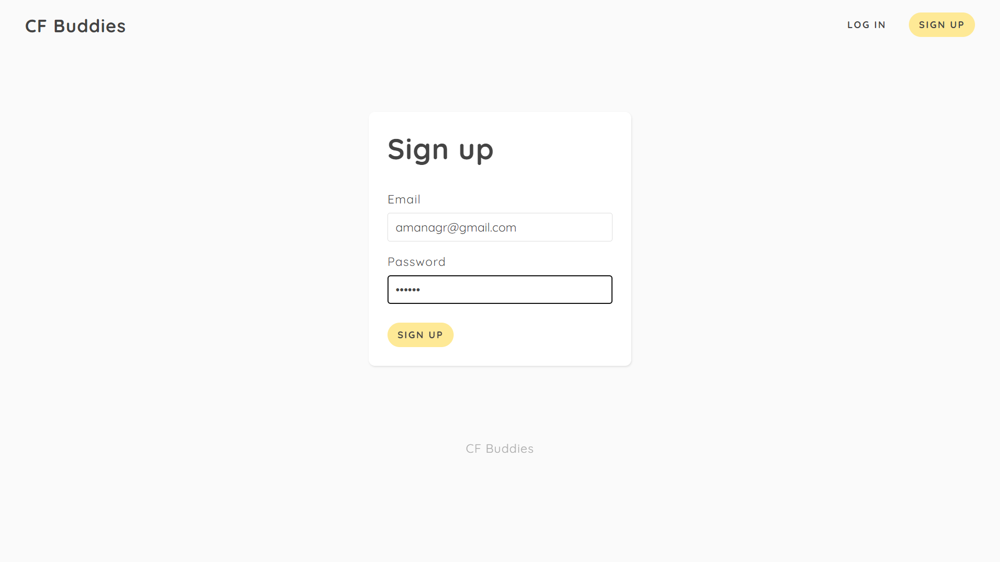
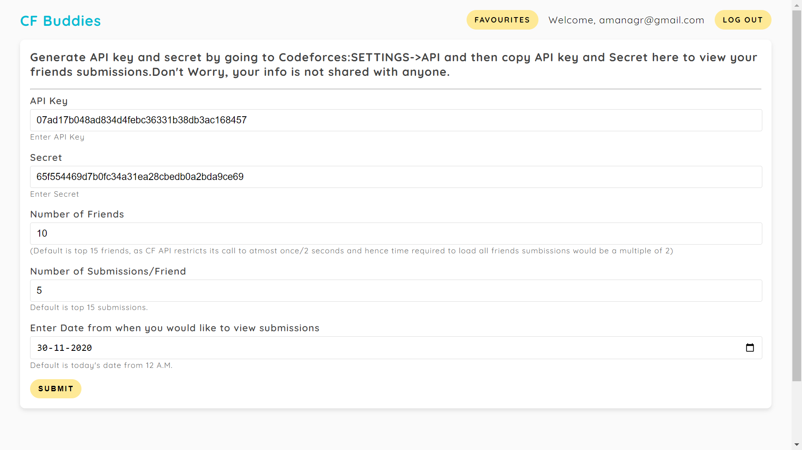
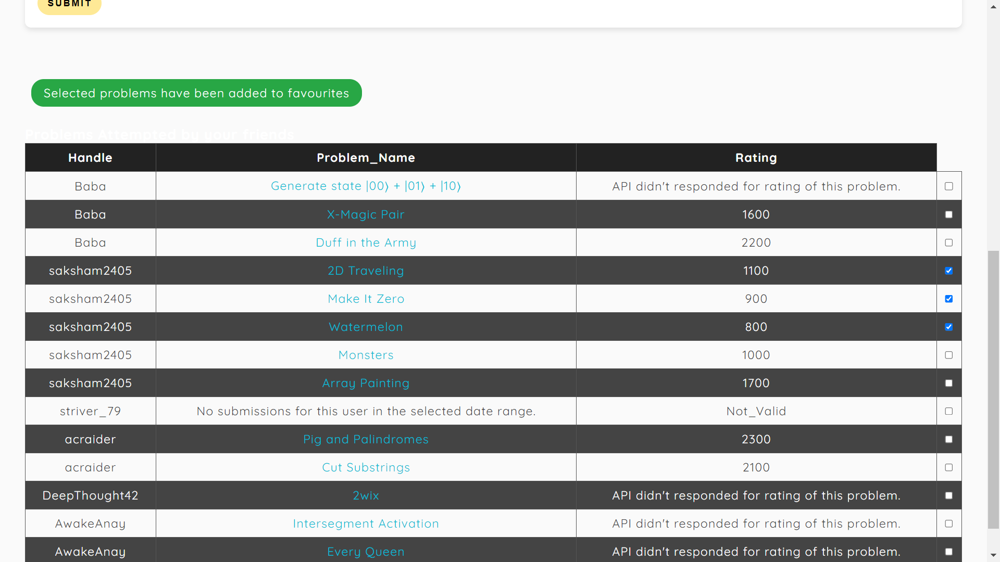
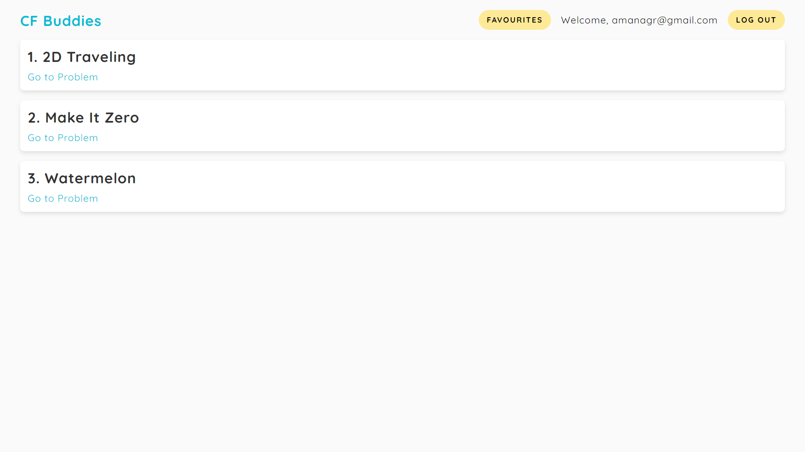

# CodeForces Buddies

Ever felt lazy about solving problems on Codeforces? But then saw your friends solving and you got motivated to just crush those with your curiosity? And wanted to solve problems that your friend intented to solve(or solved)? Look no further, this got your covered!!


- Sign Up and Login in the system.



- Use CodeForces API and your CodeForces account’s API key and Secret, with multiple customisable parameters such as start date, number of friends, and number of submissions.



- View their solved problems with a link to visit them and difficulty rating and also favourite them for later solving.



- View your favourited problems and directly go to them for solving it.



### How to Run 

```markdown
1. run npm install
2. Replace your mongodb string in app.js
3. Change secret for your jwt token or let it as it is
4. run nodemon start
```

